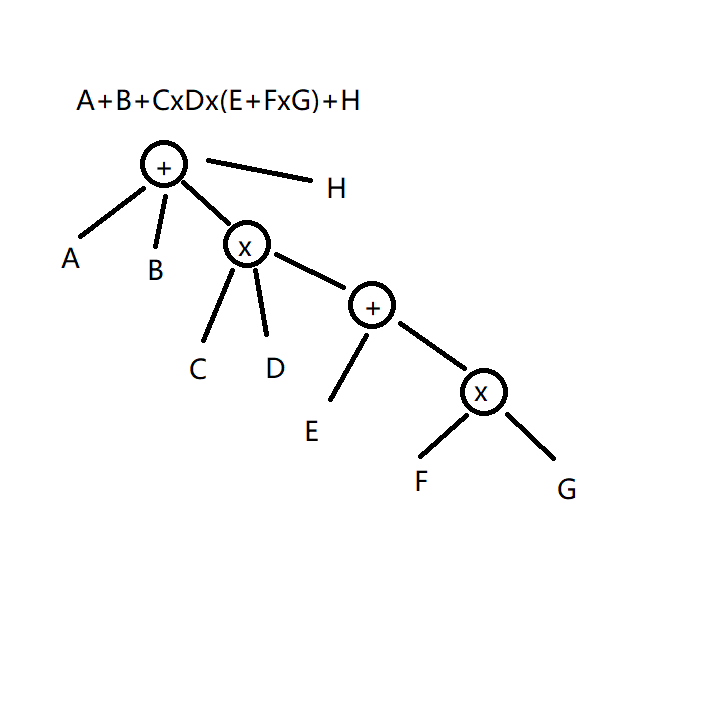

# CS205 Project 2 - A Much Better Calculator

Name: 匡亮(KuangLiang)

SID: 12111012

## Part 1 - Brief Introduction

项目位于：https://github.com/sustechkl/Simple-Calculator ，将在2022年10月17日零点设为公开（如果我忘记了，麻烦邮件提醒）。

### 交互方法：

交互方法基本模仿 Linux 下的 bc 计算器。输入会忽略所有空格，**将所有大写字母强制转换成小写**，以回车作为一次指令的结束。

1. 输入 “#help” 可以查看所有用法。
2. 输入 “#quit” 可结束进程。
3.  **支持自定义变量。** 输入的内容带有 “=” ，则将左侧作为变量名、右侧表达式作为变量值（不能出现当前变量，即，不支持解方程）。变量名只能含有数字、字母、下划线，且不应该重复（包括和函数名重复，且不区分大小写）。
4.  **支持数学函数。** 用 sqrt(x) 、 log(x) 、 sin(x) 、 cos(x) 来调用一个函数。x 可以是一个表达式。
5.  ***支持自定义函数。*** 输入的内容带有 “(x)=” ，则将左侧作为函数名，右侧可以写一个含有 x 的表达式。之后可以进行调用。

### 支持的运算：

1. 任意大小的加减乘除法。被除数过大（有效位数过多）时，除法可能很不精确。
2. 任意大小的整数对一个 $10^{17}$ 数的取模。***这里并不会检查被取模的是否为整数***，且当它过大时结果可能不准确。建议只对比较小的数使用，或在不同的地方多次取模。同时，这里的取模是 **C++ 风格** 的，即负数取模会保留负号而对绝对值取模。

### 可能的报错：

1. syntax error: 输入不能构成一个表达式。
2. invalid variable name: 错误的变量（或函数）名，可能是不合法或重复。
3. runtime error: 运算中发生错误，可能是对 $0$ 进行除法或取模等。
4. unknown command: 未知指令，如果第一个字符为 # 而之后输入的内容不是现有的指令。
5. unknown variable: 算式中出现了未知的变量名。

## Part 2 - Analysis

本次 project 相比之前提出了更多的要求：
    
    1. 更多种类的运算
    2. 支持函数
    3. 支持变量

为了便于维护，我将代码分为三个部分：

    1. simbc.h: 定义了所有用到的结构体和函数；
    2. simbc.cpp: 具体来实现这些函数；
    3. main.cpp: 使用计算器的主进程，负责解析表达式并调用各种运算函数。

### Section 1 - 表达式解析

在每层运算时，只考虑优先级**最低**的运算，对其他运算部分进行分治。这样每层只用处理一种优先级的运算（如：加减、乘除模、乘方、函数），这样函数一定会被分治到最低层。